## 数据结构实验报告
### 题目：学生成绩管理系统（链表）

- 1. 需求分析	
- 2. 概要设计  	
    - 2.1抽象数据类型	
    - 2.2主程序的流程	
    - 2.3各程序模块之间的调用关系	
- 3. 详细分析
    - 3.1 实际数据结构
    - 3.2 主函数算法
    - 3.3 录入功能算法
    - 3.4 添加功能算法
    - 3.5 删除功能算法
    - 3.6 查找功能算法
    - 3.7 修改功能算法
    - 3.8 保存功能算法
    - 3.9 打印功能算法
- 4. 调试分析
- 5. 测试结果
    - 5.1 录入功能
    - 5.2 添加功能
    - 5.3 删除功能
    - 5.4 查找功能
    - 5.5 修改功能
    - 5.6 保存&打印功能
- 6. 附录 程序源代码

### 1. 需求分析
设计一个“学生成绩管理系统”。主要实现学生信息的录入、添加、修改、删除、排序和查看等基本功能。<br>
编写一个学生成绩管理程序。学生成绩以一个学生一条记录的形式存储，每个学生记录包含的信息有序号、学号、姓名及5门功课的成绩。具体功能如下：
- a. 获取学生成绩。可以从文件中读取成绩，也可直接录入。
- b.  添加学生成绩，在学生成绩单的指定位置添加学生成绩信息。
- c.  修改学生成绩，在学生成绩单中，修改指定学生的成绩信息。
- d.  删除学生成绩，在学生成绩单中，删除指定学生的成绩信息。
- e.  查询学生成绩，输入学生学号或姓名等信息后，显示学生在成绩单中的位置及所有信息。
- f.  保存文件。当学生成绩单发生添加、修改、删除等变化后，都要对最终结果进行保存。

### 2. 概要分析
- #### 2.1 抽象数据类型
  
  本实验采用的抽象数据类型定义如下：
    ```
    ADT List{
        D={ai|ai属于Elemset,ai是存储一条学生信息记录的结构,i=1,……n}
        数据关系：
        R={<ai-1.ai>|ai-1,ai属于D,i=2,……,n}
        基本操作：
        Status InitList(& L)
        操作结果：构造一个空的线性表
        Status DestroyList(& L)
        操作结果：销毁线性表
        Status ListInsert(& L, i, e)
        操作结果：在指定位置添加学生基本信息
        Status ListDelete(& L, i)
        操作结果：在顺序表中删除第i个元素
        int ListLength(LinkList L);
        操作结果：获取顺序表的长度
    }
    ```
- #### 2.2 主程序流程
  
  主函数的算法设计为，整体运行在一个while循环中，只有选择了退出功能才会结束程序运行。首先打印出用户可选的功能选项（1-7），通过读取用户的选择进入对应的功能实现函数。<br>

- #### 2.3 各模块调用关系
    
    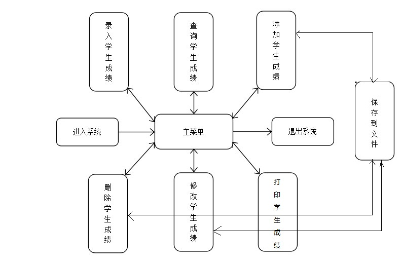
  
    
### 3. 详细分析
- #### 3.1 实际数据结构
  
  实际程序中采用的数据结构如下：
  ```
  #define student_t ElemType
  #define name_max_length 10

  typedef struct
  {
      int num;   //序号
      int ID;    //学号
      char name[name_max_length]; //姓名
      int score[5];  //成绩
  }student_t;

  struct LNode
  {
      ElemType data;
      struct LNode *next;
  };
  typedef struct LNode *LinkList;
  ```
  建立列表节点，内部分为数据域和指针域，指针域用于存储指向下一个节点的指针。数据域为一个student结构体，其中存储了学生的序号，学号，姓名，成绩。<br>
- #### 3.2 主函数算法
  主函数的伪代码如下：
  ```
  int main()
  {
      while(1) {
          char user_choice;
          //打印功能菜单
          user_choice = getchar();
          getchar();
          switch (user_choice) {
              case '1':
              {
                  //进入录入功能函数
              }

              case '2':
              {
                  //进入插入功能函数
              }

              case '3':
              {
                  //进入修改功能函数
              }

              case '4':
              {
                  //进入删除功能函数
              }

              case '5':
              {
                  //进入搜索功能函数
              }

              case '6':
              {
                  //进入输出功能函数
              }

              case '7':
              {
                  //退出整个程序
              }

              default:
              {
                  //非法输入报错
              }
              break;
          }
          system("clear");  //清屏
      }
  }
  ```
- #### 3.3 录入功能算法
   录入前询问用户是要手动输入数据还是要从文件录入数据，这两种录入方式的实现过程一样，是''创建节点，将数据录入当前节点，将当前节点的指针指向下一个节点，访问下一节点''的循环<br>
   具体的实现算法如下:
   ```
    Status load_in_information(void)
    {
        LinkList p;
        int count;
        InitList(&student_information);
        InitList(&p);
        student_information->next = p;  //创建学生信息链表与用来访问链表的指针p
        //打印功能菜单，读取用户输入（1 or 2）
        switch (user_choice)
        {
            case '1':
            {
                //用户输入将要数据的总个数count
                for(int i=0; i<count; i++)
                {
                    //打印该节点的数据表格让用户填写并赋值给节点数据域
                    p->next = (LinkList)malloc(sizeof(struct LNode));
                    p = p->next;
                }
                p->next = NULL;
                break;
            }

            case '2':
            {
                FILE *fpRead=fopen("test.txt","r");
                int counter=0;
                if(fpRead==NULL)
                {
                    return 0;
                }
                fgetc(fpRead);
                while(1)
                {
                    if(feof(fpRead) == 0)
                    {
                        //从文件中读取对应的信息填入节点数据域
                        p->next = (LinkList)malloc(sizeof(struct LNode));
                        p = p->next;
                    }
                    else break;
                }
                p->next = NULL;
                fclose(fpRead);
                break;
            }

            default:
            {
                //错误输入报错
            }
        }

    }
   ```
- #### 3.4 添加功能算法
  
  ```
  Status add_information(void)
  {
      LinkList p;
      InitList(&p);
      student_t student;  //创建student用来存储信息
      int locate;
      int count = 1;
      p = student_information->next;
      //录入插入位置locate
      //录入学生信息
      ListInsert(student_information,locate,student); //将student插入链表的locate位置
      //插入之后num的顺序就乱了，因此需要遍历链表元素，修改num
      while(p->next != NULL)
      {
          p->data.num = count++;
          p = p->next;
      }
      save_information();
  }
  ```
- #### 3.5 删除功能算法
  
  ```
    Status delete_information(void)
    {
        LinkList p;
        InitList(&p);
        student_t student;
        int locate;
        int count = 1;
        p = student_information->next;
        //获取删除位置
        ListDelete(student_information,locate,&student);  //删除对应元素
        //重排链表序号
        while(p->next != NULL)
        {
            p->data.num = count++;
            p = p->next;
        }
        save_information();
    }
  ```
- #### 3.6 查找功能算法
  
  查找算法分成了按名查找，按序号查找，按学号查找三种方式，但每种算法的本质一样，都是遍历链表查找对应元素
  ```
  Status search_information(void)
  {
      char user_choice;
      LinkList p;
      InitList(&p);
      p = student_information->next;
      //输入用户选择功能
      switch (user_choice)
      {
          case '1':
          {
              int num;
              //输入查找的序号
              while(p->next != NULL)
              {
                  if(p->data.num == num)
                  {
                      //输出信息
                      }
                      break;
                  }
                  else
                  {
                      p = p->next;
                  }
              }
              //如果未找到则打印未找到
              if(p == NULL) printf("NOT FOUND!!\n");
              break;
          }

          case '3':
          {
              //按名查找功能
              //查找算法和按序号查找一致，只是换成了判断名字
          }

          case '2':
          {
              //按学号查找功能
              //查找算法和按序号查找一致，只是换成了判断学号
          }

          default:
          {
              //错误输入报错
          }
      }
  }
  ```
- #### 3.7 修改功能算法
  
  修改功能实际上是查找并修改，因此查找算法和3.4是一致的，只是找到元素后是访问并修改
  ```
  Status change_information(void)
  {
      char user_choice;
      LinkList p;
      InitList(&p);
      p = student_information->next;
      //输入用户选择功能
      switch (user_choice)
      {
          case '1':
          {
              int num;
              //输入查找的序号
              while(p->next != NULL)
              {
                  if(p->data.num == num)
                  {
                      //修改该元素的信息
                      }
                      break;
                  }
                  else
                  {
                      p = p->next;
                  }
              }
              //如果未找到则打印未找到
              if(p == NULL) printf("NOT FOUND!!\n");
              break;
          }

          case '3':
          {
              //按名修改功能
              //算法和按序号修改一致，只是换成了判断名字
          }

          case '2':
          {
              //按学号修改功能
              //算法和按序号修改一致，只是换成了判断学号
          }

          default:
          {
              //错误输入报错
          }
      }
      //保存信息
      save_information();
  }
  ```
- #### 3.8 保存功能算法

  ```
    Status save_information(void)
    {
        LinkList p;
        InitList(&p);
        p = student_information->next;

        FILE *fpWrite=fopen("test.txt","w");

        if(fpWrite==NULL)
        {
            return 0;
        }
        while(p->next != NULL)
        {
            //将信息输出至文件
            p = p->next;
        }
        fclose(fpWrite);
    }
  ```
- #### 3.9 打印功能算法

  ```
    Status output_information(void)
    {
        LinkList p;
        InitList(&p);
        p = student_information->next;
        while(p->next != NULL)
        {
            //输出信息
            p = p->next;
        }
        p->next = NULL;
        //保存
        save_information();
    }
  ```

### 4. 调试分析

本次实验通过线性链表实现了一个简单的学生信息统计系统。在实现系统的过程中，我温习了链表有关的基本操作，包括创建链表，插入元素，删除元素等，巩固了理论知识。此外也复习了C语言的文件操作（实际上读写文件上花费的时间比实现其他功能多了不少，主要还是不熟练）。<br>
目前整个系统已经能够基本上完成要求的功能，但仍然存在许多欠缺的地方，比如很多地方没有做输入合法性检测，导致一些非法输入可以导致程序卡死。另外也没有利用好各个功能的返回值，否则可以在程序运行出错时有充分的出错提示信息。最后，在一些算法的处理上比较低效，整个工程的代码结构也并不是非常合理。从软件工程的角度上来说，这个代码还有许多亟需优化的地方。<br>
最后总结一下自己完成代码的过程
1. 设计之前先想好需要哪些功能模块
2. 从功能模块出发去思考如何细分成更小的模块
3. 整理出可以编程实现的小模块，列出API表
4. 实现具体函数
5. 按照函数-->模块-->整体的顺序去进行功能测试

### 5. 测试结果
- #### 5.1 录入功能
  
  - 手动输入录入
  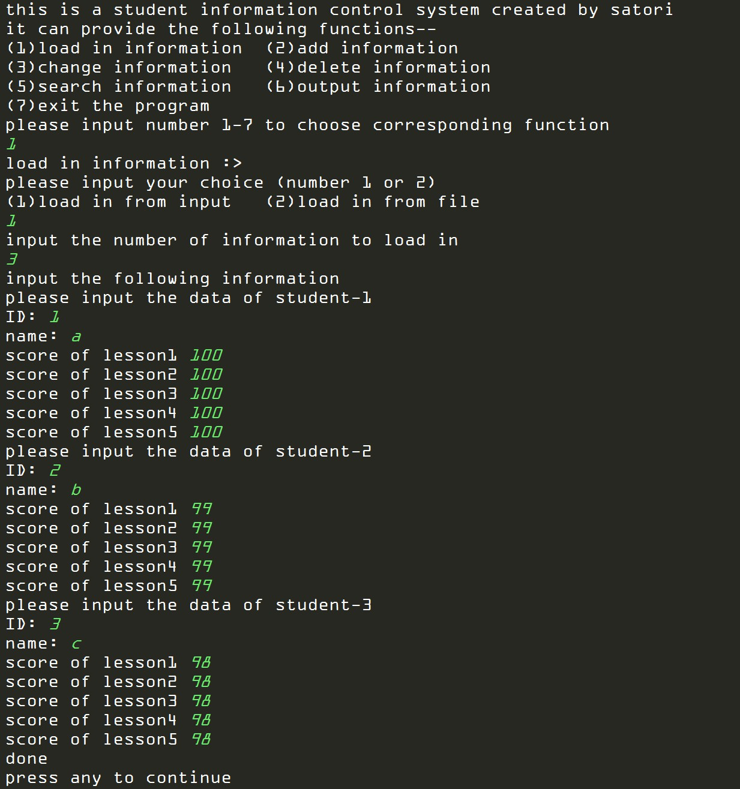
  - 从文件录入，录入的信息为5.6执行完后保存在文件的信息
  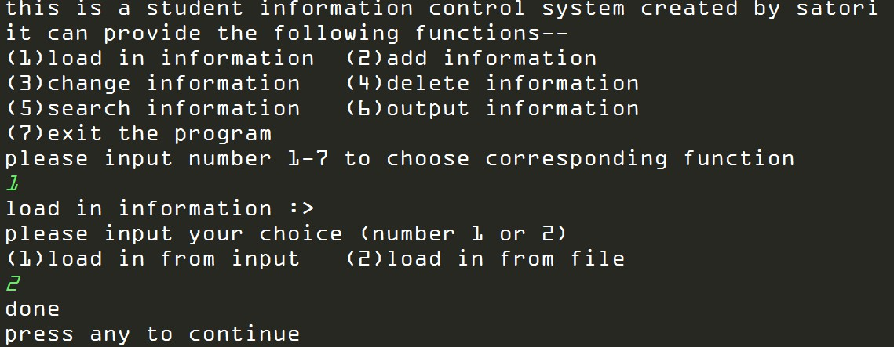
  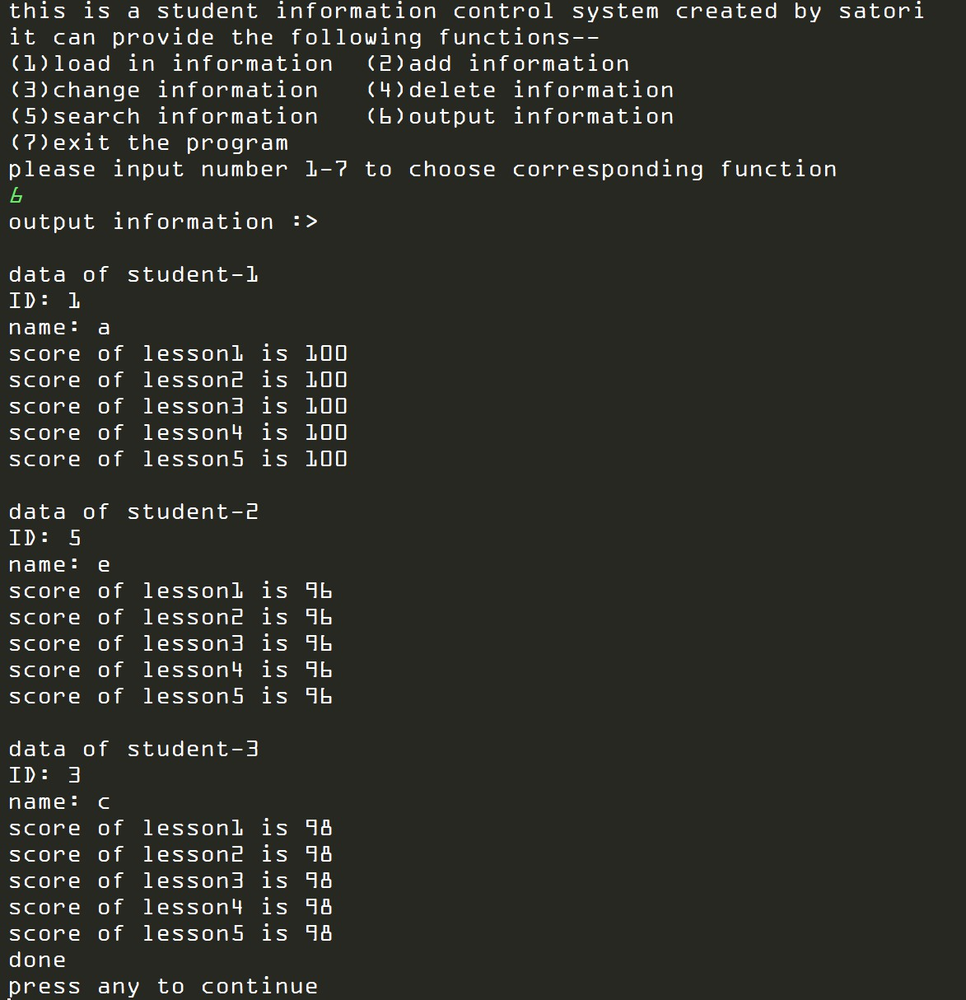
- #### 5.2 添加功能
  
  - 添加功能
  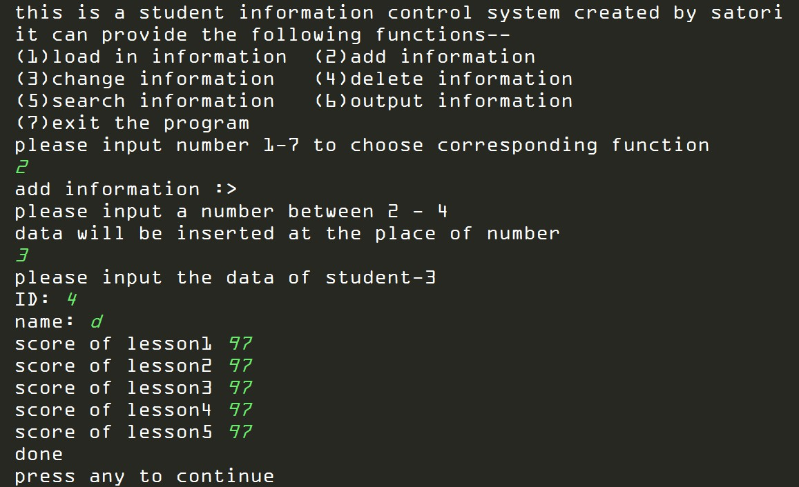
  - 打印输出添加后的结果
  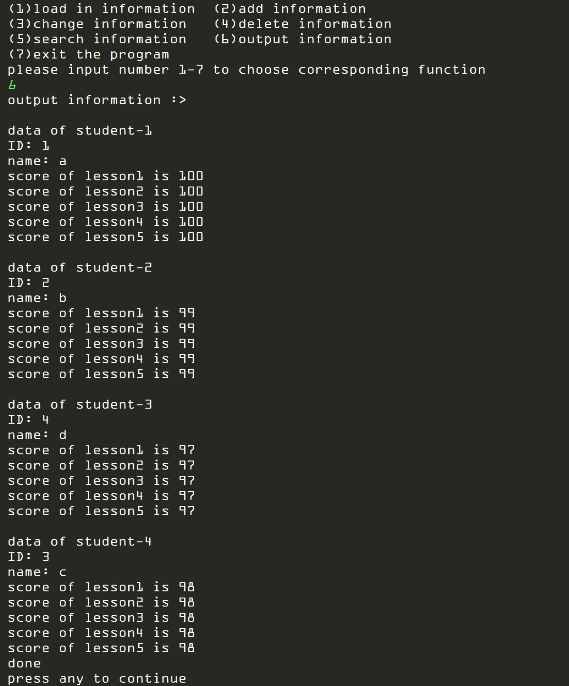
- #### 5.3 删除功能
  
  - 删除并打印 
  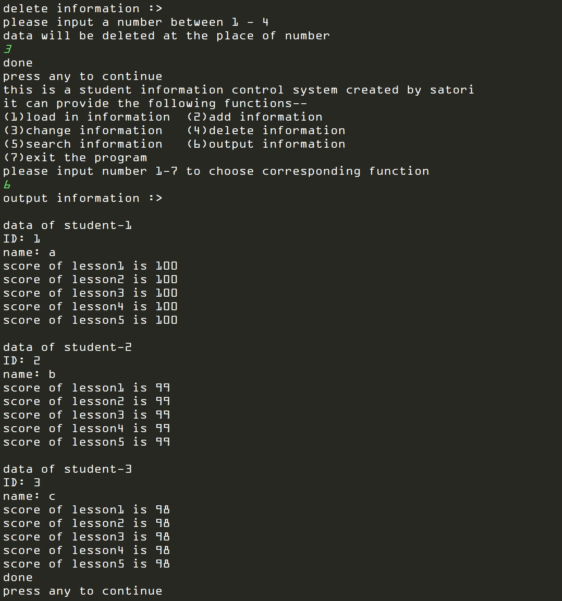
- #### 5.4 查找功能
  
  - 仅按名查找功能
  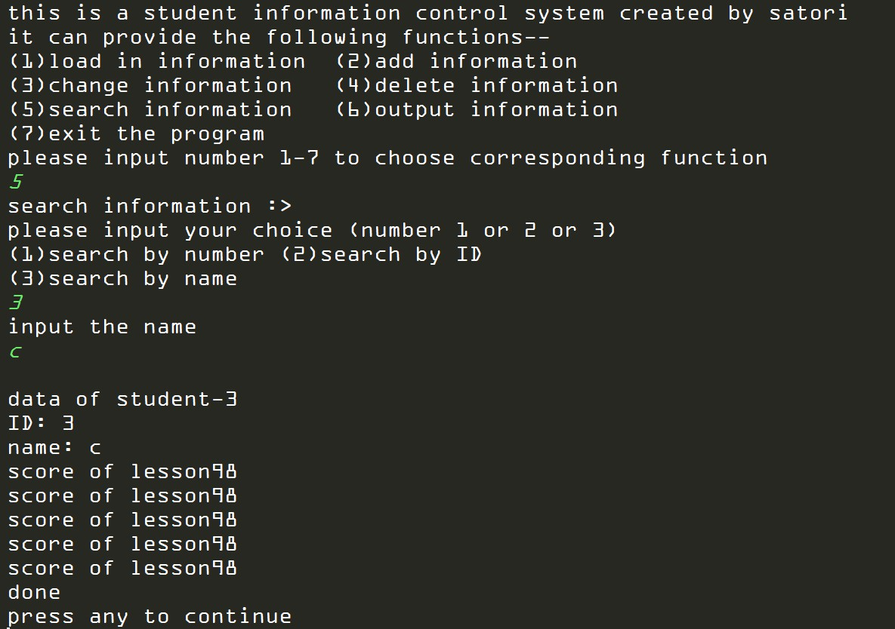
- #### 5.5 修改功能
  
  - 仅演示按学号查找并修改功能
  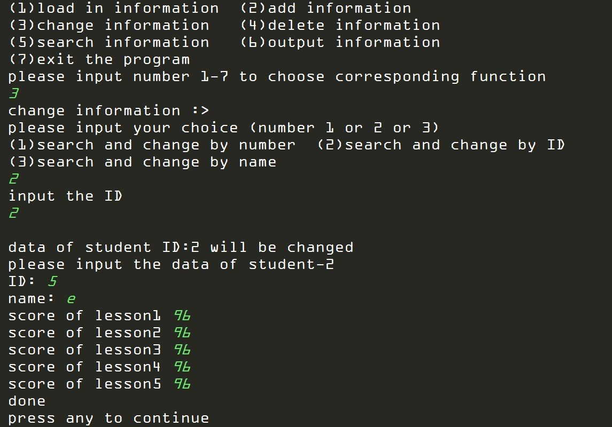
  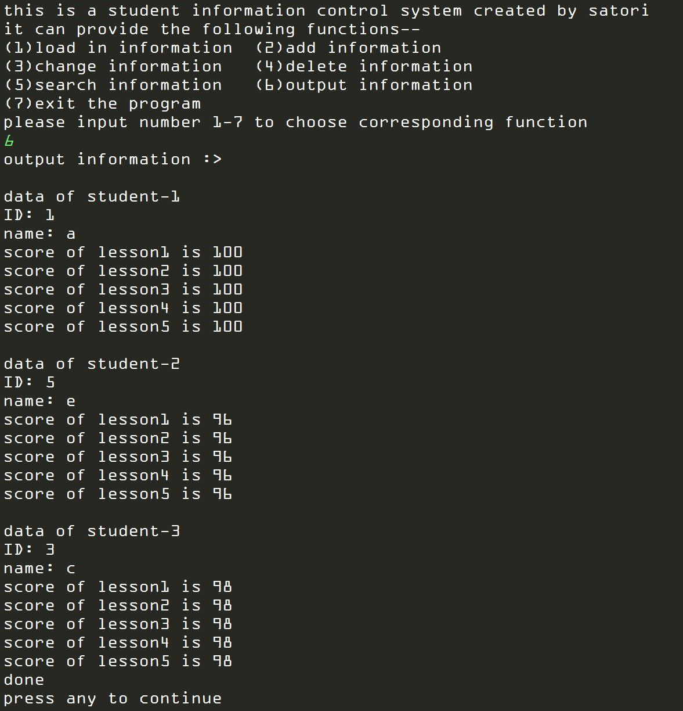
- #### 5.6 保存功能
  
  - 保存了修改功能执行完后的数据在文件test.txt中
  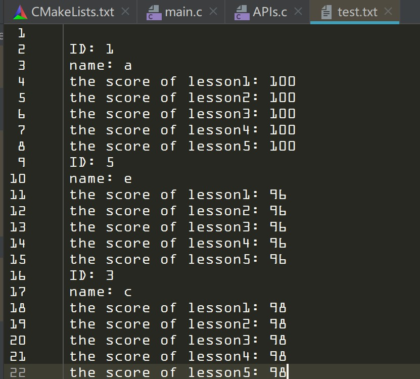
### 6. 附录 程序源代码
文件APIs.h
```
#ifndef DATASTRUCTURE_LAB_1_APIS_H
#define DATASTRUCTURE_LAB_1_APIS_H

#include <stdio.h>
#include <malloc.h>
#include <string.h>
#include <stdlib.h>
#include <windows.h>

#define student_t ElemType
#define name_max_length 10

//定义学生数据结构
typedef enum
{
    OK = 1,
    OVERFLOW = 2
}Status;

typedef struct
{
    int num;   //序号
    int ID;    //学号
    char name[name_max_length];
    int score[5];
}student_t;

struct LNode
{
    ElemType data;
    struct LNode *next;
};
typedef struct LNode *LinkList;

//底层API
Status InitList(LinkList *L);
int ListLength(LinkList L);
Status ListInsert(LinkList L,int i,ElemType e);
Status ListDelete(LinkList L,int i,ElemType *e);

//用户API
Status load_in_information(void);
Status add_information(void);
Status change_information(void);
Status delete_information(void);
Status search_information(void);
Status output_information(void);
Status save_information(void);
#endif //DATASTRUCTURE_LAB_1_APIS_H
```

文件main.c
```
#include "APIs.h"

int main()
{
    while(1) {
        char user_choice;
        printf("this is a student information control system created by satori\n");
        printf("it can provide the following functions--\n");
        printf("(1)load in information\t(2)add information\n");
        printf("(3)change information\t(4)delete information\n");
        printf("(5)search information\t(6)output information\n");
        printf("(7)exit the program\n");
        printf("please input number 1-7 to choose corresponding function\n");
        user_choice = getchar();
        getchar();
        switch (user_choice) {
            case '1':
            {
                printf("load in information :>\n");
                load_in_information();
                printf("done\n");
                printf("press any to continue\n");
                getchar();
                break;
            }

            case '2':
            {
                printf("add information :>\n");
                add_information();
                printf("done\n");
                printf("press any to continue\n");
                getchar();
                break;
            }

            case '3':
            {
                printf("change information :>\n");
                change_information();
                printf("done\n");
                printf("press any to continue\n");
                getchar();
                break;
            }

            case '4':
            {
                printf("delete information :>\n");
                delete_information();
                printf("done\n");
                printf("press any to continue\n");
                getchar();
                break;
            }

            case '5':
            {
                printf("search information :>\n");
                search_information();
                printf("done\n");
                printf("press any to continue\n");
                getchar();
                getchar();
                break;
            }

            case '6':
            {
                printf("output information :>\n");
                output_information();
                printf("done\n");
                printf("press any to continue\n");
                getchar();
                break;
            }

            case '7':
            {
                printf("press any key to exit the program :>");
                getchar();
                return 0;
            }

            default:
            {
                printf("input error,please input number 1-7 again :<\n");
            }
            break;
        }
        system("clear");
    }
}
```
文件APIs.c
```
#include "APIs.h"

//
// Created by 28617 on 2019/5/17.
//

//一个全局的链表
LinkList student_information;

//讨来的API

Status InitList(LinkList *L)
{
    *L=(LinkList)malloc(sizeof(struct LNode));
    if(!*L)
        exit(OVERFLOW);
    (*L)->next=NULL;
    return OK;
}

int ListLength(LinkList L)
{
    int i=0;
    LinkList p=L->next;
    while(p)
    {
        i++;
        p=p->next;
    }
    return i;
}

Status ListInsert(LinkList L,int i,ElemType e)
{
    int j=0;
    LinkList p=L,s;
    while(p&&j<i-1)
    {
        p=p->next;
        j++;
    }
    if(!p||j>i-1)
        return ERROR;
    s=(LinkList)malloc(sizeof(struct LNode));
    s->data=e;
    s->next=p->next;
    p->next=s;
    return OK;
}

Status ListDelete(LinkList L,int i,ElemType *e)
{
    int j=0;
    LinkList p=L,q;
    while(p->next&&j<i-1)
    {
        p=p->next;
        j++;
    }
    if(!p->next||j>i-1)
        return ERROR;
    q=p->next;
    p->next=q->next;
    *e=q->data;
    free(q);
    return OK;
}

//下面是自己写的功能函数
Status load_in_information(void)
{
    char user_choice;
    LinkList p;
    int count;
    InitList(&student_information);
    InitList(&p);
    student_information->next = p;
    printf("please input your choice (number 1 or 2)\n");
    printf("(1)load in from input\t(2)load in from file\n");
    user_choice = getchar();
    switch (user_choice)
    {
        case '1':
        {
            printf("input the number of information to load in\n");
            scanf("%d",&count);
            printf("input the following information\n");
            for(int i=0; i<count; i++)
            {
                p->data.num = i+1;
                printf("please input the data of student-%d\n",p->data.num);
                printf("ID: ");
                scanf("%d",&p->data.ID);
                printf("name: ");
                scanf("%s",p->data.name);
                for(int j=0; j<5 ; j++)
                {
                    printf("score of lesson%d ",j+1);
                    scanf("%d",&p->data.score[j]);
                }
                p->next = (LinkList)malloc(sizeof(struct LNode));
                p = p->next;
            }
            p->next = NULL;
            break;
        }

        case '2':
        {
            FILE *fpRead=fopen("test.txt","r");
            int counter=0;
            if(fpRead==NULL)
            {
                return 0;
            }
            fgetc(fpRead);
            while(1)
            {
                if(feof(fpRead) == 0)
                {
                    p->data.num = ++counter;
                    fscanf(fpRead,"ID: %d\n",&p->data.ID);
                    fscanf(fpRead,"name: %s\n",p->data.name);
                    for (int i = 0; i < 5; i++)
                    {
                        fscanf(fpRead,"the score of lesson");
                        fgetc(fpRead);
                        fscanf(fpRead,": %d\n",&p->data.score[i]);
                    }
                    p->next = (LinkList)malloc(sizeof(struct LNode));
                    p = p->next;
                }
                else break;
            }
            p->next = NULL;
            fclose(fpRead);
            break;
        }

        default:
        {
            printf("wrong number :<\n");
            break;
        }
    }

}

Status add_information(void)
{
    LinkList p;
    InitList(&p);
    student_t student;
    int locate;
    int count = 1;
    p = student_information->next;
    printf("please input a number between 2 - %d\ndata will be inserted at the place of number\n",ListLength(student_information));
    scanf("%d",&locate);
    printf("please input the data of student-%d\n",locate);
    student.num = locate;
    printf("ID: ");
    scanf("%d",&student.ID);
    printf("name: ");
    scanf("%s",student.name);
    for(int j=0; j<5 ; j++)
    {
        printf("score of lesson%d ",j+1);
        scanf("%d",&student.score[j]);
    }
    ListInsert(student_information,locate,student);
    //插入之后num的顺序就乱了，因此需要遍历locate后面的元素，修改所有的num
    while(p->next != NULL)
    {
        p->data.num = count++;
        p = p->next;
    }
    save_information();
}

Status change_information(void)
{
    char user_choice;
    LinkList p;
    InitList(&p);
    p = student_information->next;
    printf("please input your choice (number 1 or 2 or 3)\n");
    printf("(1)search and change by number\t(2)search and change by ID\n");
    printf("(3)search and change by name\n");
    user_choice = getchar();
    getchar();
    switch (user_choice)
    {
        case '1':
        {
            int num;
            printf("input the num\n");
            scanf("%d",&num);
            while(p)
            {
                if(p->data.num == num)
                {
                    printf("\ndata of student-%d will be changed\n",p->data.num);
                    printf("please input the data of student-%d\n",p->data.num);
                    printf("ID: ");
                    scanf("%d",&p->data.ID);
                    printf("name: ");
                    scanf("%s",p->data.name);
                    for(int j=0; j<5 ; j++)
                    {
                        printf("score of lesson%d ",j+1);
                        scanf("%d",&p->data.score[j]);
                    }
                    break;
                }
                else
                {
                    p = p->next;
                }
            }
            if(p == NULL) printf("NOT FOUND!!\n");
            break;
        }

        case '3':
        {
            char name[name_max_length];
            printf("input the name\n");
            scanf("%s",name);
            while(p)
            {
                if(strcmp(p->data.name,name) == 0)
                {
                    printf("\ndata of student name:%s will be changed\n",p->data.name);
                    printf("please input the data of student-%d\n",p->data.num);
                    printf("ID: ");
                    scanf("%d",&p->data.ID);
                    printf("name: ");
                    scanf("%s",p->data.name);
                    for(int j=0; j<5 ; j++)
                    {
                        printf("score of lesson%d ",j+1);
                        scanf("%d",&p->data.score[j]);
                    }
                    break;
                }
                else
                {
                    p = p->next;
                }
            }
            if(p == NULL) printf("NOT FOUND!!\n");
            break;
        }

        case '2':
        {
            int ID;
            printf("input the ID\n");
            scanf("%d",&ID);
            while(p)
            {
                if(p->data.num == ID)
                {
                    printf("\ndata of student ID:%d will be changed\n",p->data.ID);
                    printf("please input the data of student-%d\n",p->data.num);
                    printf("ID: ");
                    scanf("%d",&p->data.ID);
                    printf("name: ");
                    scanf("%s",p->data.name);
                    for(int j=0; j<5 ; j++)
                    {
                        printf("score of lesson%d ",j+1);
                        scanf("%d",&p->data.score[j]);
                    }
                    break;
                }
                else
                {
                    p = p->next;
                }
            }
            if(p == NULL) printf("NOT FOUND!!\n");
            break;
        }

        default:
        {
            printf("wrong number :<\n");
            break;
        }
    }
    save_information();
}

Status delete_information(void)
{
    LinkList p;
    InitList(&p);
    student_t student;
    int locate;
    int count = 1;
    p = student_information->next;
    printf("please input a number between 1 - %d\ndata will be deleted at the place of number\n",ListLength(student_information)-1);
    scanf("%d",&locate);
    ListDelete(student_information,locate,&student);
    while(p->next != NULL)
    {
        p->data.num = count++;
        p = p->next;
    }
    save_information();
}

Status search_information(void)
{
    char user_choice;
    LinkList p;
    InitList(&p);
    p = student_information->next;
    printf("please input your choice (number 1 or 2 or 3)\n");
    printf("(1)search by number\t(2)search by ID\n");
    printf("(3)search by name\n");
    user_choice = getchar();
    getchar();
    switch (user_choice)
    {
        case '1':
        {
            int num;
            printf("input the num\n");
            scanf("%d",&num);
            while(p->next != NULL)
            {
                if(p->data.num == num)
                {
                    printf("\ndata of student-%d\n",p->data.num);
                    printf("ID: %d\n",p->data.ID);
                    printf("name: %s\n",p->data.name);
                    for(int j=0; j<5 ; j++)
                    {
                        printf("score of lesson%d \n",p->data.score[j]);
                    }
                    break;
                }
                else
                {
                    p = p->next;
                }
            }
            if(p == NULL) printf("NOT FOUND!!\n");
            break;
        }

        case '3':
        {
            char name[name_max_length];
            printf("input the name\n");
            scanf("%s",name);
            while(p)
            {
                if(strcmp(p->data.name,name) == 0)
                {
                    printf("\ndata of student-%d\n",p->data.num);
                    printf("ID: %d\n",p->data.ID);
                    printf("name: %s\n",p->data.name);
                    for(int j=0; j<5 ; j++)
                    {
                        printf("score of lesson%d \n",p->data.score[j]);
                    }
                    break;
                }
                else
                {
                    p = p->next;
                }
            }
            if(p == NULL) printf("NOT FOUND!!\n");
            break;
        }

        case '2':
        {
            int ID;
            printf("input the ID\n");
            scanf("%d",&ID);
            while(p->next != NULL)
            {
                if(p->data.num == ID)
                {
                    printf("\ndata of student-%d\n",p->data.num);
                    printf("ID: %d\n",p->data.ID);
                    printf("name: %s\n",p->data.name);
                    for(int j=0; j<5 ; j++)
                    {
                        printf("score of lesson%d \n",p->data.score[j]);
                    }
                    break;
                }
                else
                {
                    p = p->next;
                }
            }
            if(p == NULL) printf("NOT FOUND!!\n");
            break;
        }

        default:
        {
            printf("wrong number :<\n");
            break;
        }
    }
}

Status output_information(void)
{
    LinkList p;
    InitList(&p);
    p = student_information->next;
    while(p->next != NULL)
    {
        printf("\ndata of student-%d\n",p->data.num);
        printf("ID: %d\n",p->data.ID);
        printf("name: %s\n",p->data.name);
        for(int j=0; j<5 ; j++)
        {
            printf("score of lesson%d is %d\n",j+1,p->data.score[j]);
        }
        p = p->next;
    }
    p->next = NULL;
    save_information();
}

Status save_information(void)
{
    LinkList p;
    InitList(&p);
    p = student_information->next;

    FILE *fpWrite=fopen("test.txt","w");

    if(fpWrite==NULL)
    {
        return 0;
    }
    while(p->next != NULL)
    {
        fprintf(fpWrite,"\nID: %d\n",p->data.ID);
        fprintf(fpWrite,"name: %s\n",p->data.name);

        for (int i = 0; i < 4; i++)
        {
            fprintf(fpWrite,"the score of lesson%d: %d\n",i+1,p->data.score[i]);
        }
        fprintf(fpWrite,"the score of lesson5: %d",p->data.score[4]);
        p = p->next;
    }
    fclose(fpWrite);
}

```