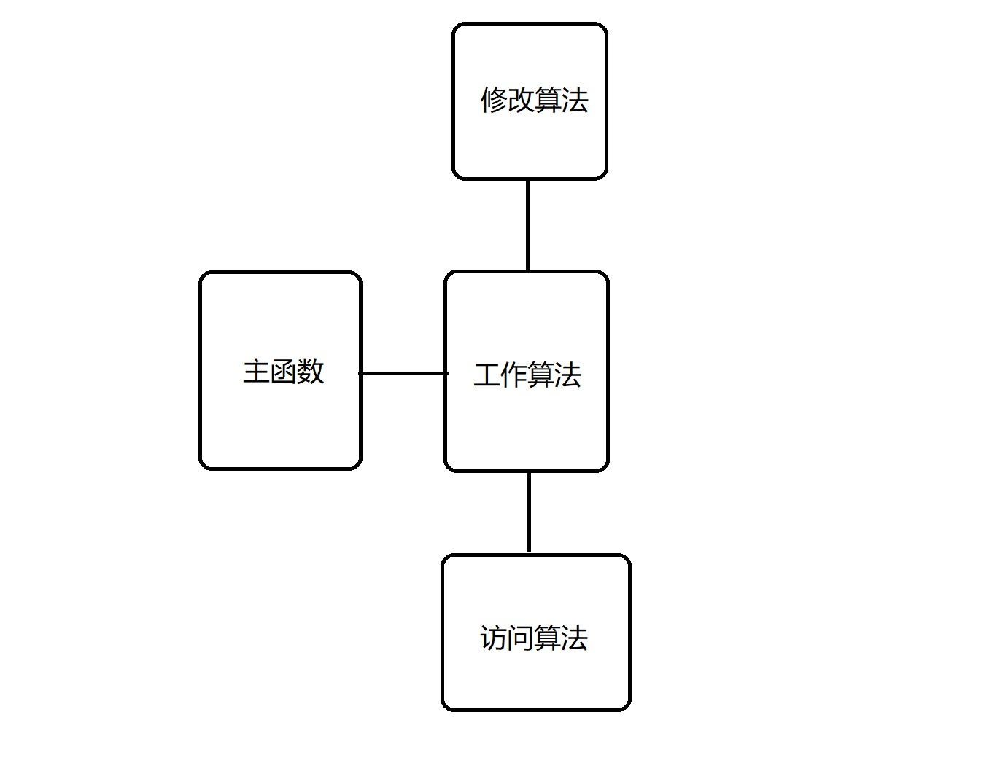
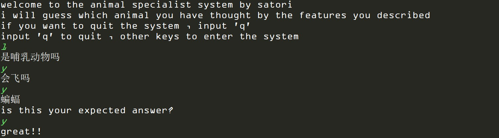
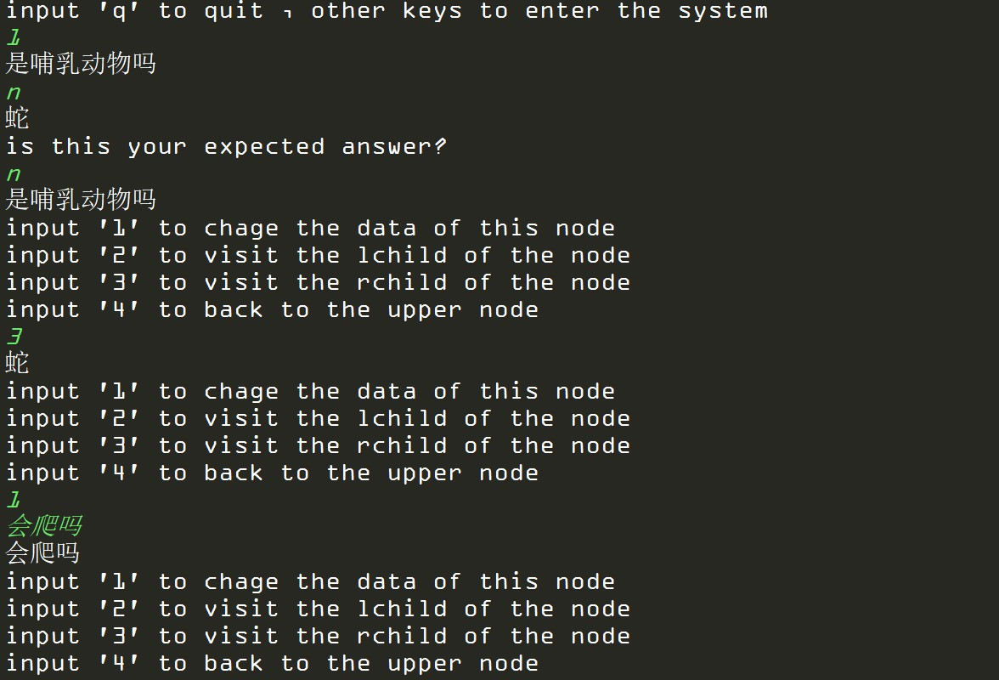
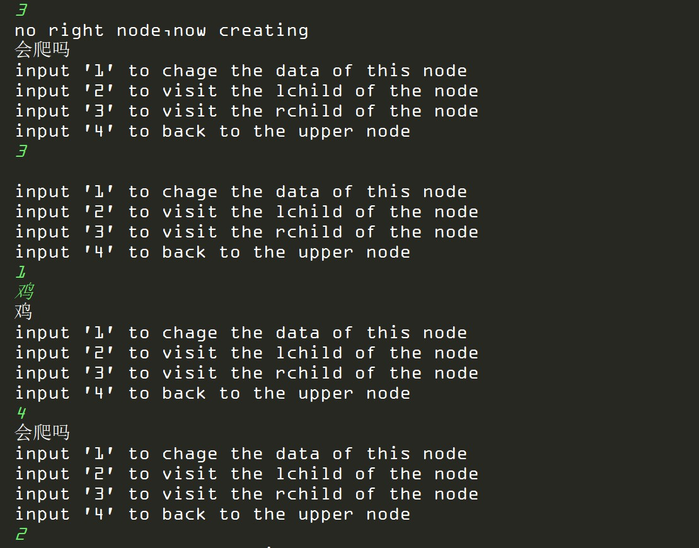
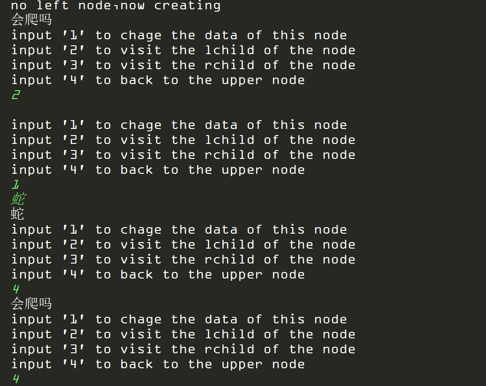
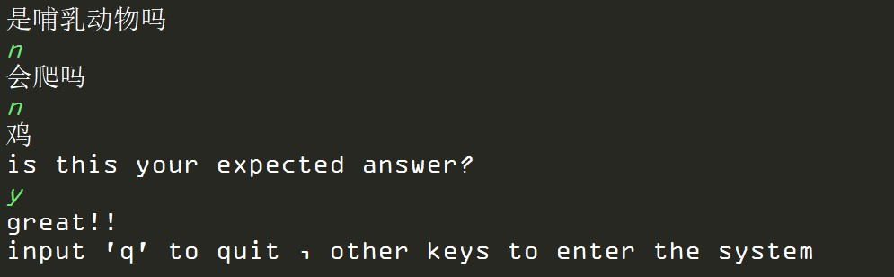

## 数据结构实验报告
### 题目：动物专家系统

- 1. 需求分析	
- 2. 概要设计  	
    - 2.1抽象数据类型	
    - 2.2主程序的流程	
    - 2.3各程序模块之间的调用关系	
- 3. 详细分析
    - 3.1 实际数据结构
    - 3.2 主函数算法
    - 3.3 访问算法
    - 3.4 修改算法
    - 3.5 工作算法
- 4. 调试分析
- 5. 测试结果
- 6. 附录 程序源代码

### 1. 需求分析
编写一个程序，实现猜动物名称的游戏。猜者猜出动物名称为赢，猜不出为输。猜者通过不断的学习，可猜到更多的动物，终将成为动物专家。
- a.  设程序用户为游戏的玩者，计算机为游戏的猜者。用户想赢，就尽量想出计算机知识库中没有的动物，但赢后要将新动物的名称及特征告诉计算机。
- b.  作为猜者的计算机要建立一个基本问题的知识库，每个问题让它减少考虑的动物数，这些问题是关于某种动物的基本特征。计算机利用这些基本问题向用户提问，根据用户回答，来控制程序流程。当程序已经减少到它考虑的动物仅有一只时，就猜这个动物。如果猜对了，计算机赢，否则，用户赢。此时，计算机要问用户所想动物的名称及该动物用于区分其它动物的特征，并将这些信息添加到知识库中。
- c.  计算机要想赢，就要不断学习以丰富自己的知识库。随着时间的流逝，随着程序基本知识的增长，计算机将成为猜动物的专家。该程序实现了模拟学习过程。


### 2. 概要分析
- #### 2.1 抽象数据类型
  
  本实验采用的抽象数据类型定义如下：
    ```
    ADT List{
        D={ai|ai属于Elemset,i=1,……n}
        数据关系：
        R={<ai-1.ai>|ai-1,ai属于D,i=2,……,n}
        基本操作：
        //创建空树
        CreateBiTree(BiTree *T)
        //访问左子树
        TElemType LeftChild(BiTree T,TElemType e)
        //访问右子树
        TElemType RightChild(BiTree T,TElemType e)
        //插入孩子
        InsertChild(BiTree p,int LR,BiTree c)
    }
    ```
- #### 2.2 主程序流程
  
  主函数的算法设计为，整体运行在一个while循环中，只有按下退出键q才会结束程序运行。其他情况下首先进入visit功能，与用户进行问答，如果最后出来的结果不正确则进入change功能，用户修改整个数据库，让整个系统的知识结构符合要求。<br>

- #### 2.3 各模块调用关系
    
  

### 3. 详细分析
- #### 3.1 实际数据结构
  
  ```
    typedef struct BiTNode
    {
        TElemType data[MAXSIZE];
        struct BiTNode *lchild,*rchild; /* 左右孩子指针 */
    }BiTNode,*BiTree;
  ```

- #### 3.2 主函数算法
  
    如果输入q就退出程序，否则进入工作算法

- #### 3.3 访问算法
  
    遍历整个树，每个节点询问用户是或否，是则访问左结点，否则访问右结点

- #### 3.4 修改算法
  
    提供修改节点数据，创建或者访问左结点/右结点，返回到上一个节点等功能

- #### 3.5 工作算法
  
    初始化树之后，提供访问算法和修改算法的入口

### 4. 调试分析
本次实验通过二叉树完成了一个动物专家系统，系统具备一定的自我学习能力，通过用户输入的知识可以不断地成长。<br>
目前整个系统已经能够基本上完成要求的功能，但仍然存在许多欠缺的地方，比如很多地方没有做输入合法性检测，导致一些非法输入可以导致程序卡死。另外也没有利用好各个功能的返回值，否则可以在程序运行出错时有充分的出错提示信息。最后，在一些算法的处理上比较低效，整个工程的代码结构也并不是非常合理。从软件工程的角度上来说，这个代码还有许多亟需优化的地方。<br>
最后总结一下自己完成代码的过程
1. 设计之前先想好需要哪些功能模块
2. 从功能模块出发去思考如何细分成更小的模块
3. 整理出可以编程实现的小模块，列出API表
4. 实现具体函数
5. 按照函数-->模块-->整体的顺序去进行功能测试

### 5. 测试结果
- 1.直接访问
  
- 2.修改功能
  
  
  
- 3.修改后进行访问
  
### 6. 附录 程序源代码
tree.h
```
#ifndef TREE_H
#define TREE_H

#include <stdio.h>
#include <stdlib.h>
#include <malloc.h>
#include <windows.h>
#include <string.h>

#define TElemType   char
#define MAXSIZE    100

/* c6-2.h 二叉树的二叉链表存储表示 */
typedef struct BiTNode
{
    TElemType data[MAXSIZE];
    struct BiTNode *lchild,*rchild; /* 左右孩子指针 */
}BiTNode,*BiTree;

int change(BiTree *tree);
int visit(BiTree *tree);
int animal_sys(void);
int working(BiTree *tree);

#endif
```
tree.c
```
#include "tree.h"

int change(BiTree *tree)
{
    while(1)
    {
        printf("%s\n",(*tree)->data);
        char choice;
        printf("input '1' to chage the data of this node\n"
               "input '2' to visit the lchild of the node\n"
               "input '3' to visit the rchild of the node\n"
               "input '4' to back to the upper node\n");
        scanf("%c",&choice);
        getchar();
        switch (choice)
        {
            case '1':
            {
                char input[MAXSIZE];
                scanf("%s",input);
                getchar();
                strcpy((*tree)->data,input);
                break;
            }
            case '2':
            {
                if((*tree)->lchild == NULL)
                {
                    printf("no left node,now creating\n");
                    (*tree)->lchild = (BiTree)malloc(sizeof(BiTNode));
                }
                else
                {
                    change(&(*tree)->lchild);
                }
                break;
            }
            case '3':
            {
                if((*tree)->rchild == NULL)
                {
                    printf("no right node,now creating\n");
                    (*tree)->rchild = (BiTree)malloc(sizeof(BiTNode));
                }
                else
                {
                    change(&(*tree)->rchild);
                }
                break;
            }
            case '4':
            {
                return 0;
            }
            default:
            {
                printf("input error");
                break;
            }
        }
    }
}

int visit(BiTree *tree)
{
    printf("%s\n",(*tree)->data);
    if((*tree)->lchild == NULL && (*tree)->rchild == NULL)
        return 1;
    char choice;
    scanf("%c",&choice);
    getchar();
    if(choice == 'y')
        visit(&(*tree)->lchild);
    else if(choice == 'n')
        visit(&(*tree)->rchild);
    else
    {
        printf("error input\n");
        return 0;
    }
}

int working(BiTree *tree)
{
    char choice;
    int flag=0;
    printf("is this your expected answer?\n");
    scanf("%c",&choice);
    getchar();

    if(choice == 'y')
    {
        printf("great!!\n");
        return 1;
    }
    else if(choice == 'n')
    {
        change(tree);
        visit(tree);
        working(tree);
    }
    else if(choice == 'q')
    {
        flag = 1;
    }
    else
    {
        printf("error input\n");
    }
    while(flag == 1)
    {
        return 0;
    }

}

int animal_sys(void)
{
    BiTree* animal_system;
    *animal_system = (BiTree)malloc(sizeof(BiTNode));
    strcpy((*animal_system)->data,"是哺乳动物吗");

    (*animal_system)->lchild = (BiTree)malloc(sizeof(BiTNode));
    strcpy((*animal_system)->lchild->data,"会飞吗");
    (*animal_system)->lchild->lchild = (BiTree)malloc(sizeof(BiTNode));
    strcpy((*animal_system)->lchild->lchild->data,"蝙蝠");
    (*animal_system)->lchild->rchild = (BiTree)malloc(sizeof(BiTNode));
    strcpy((*animal_system)->lchild->rchild->data,"猴子");

    (*animal_system)->rchild = (BiTree)malloc(sizeof(BiTNode));
    strcpy((*animal_system)->rchild->data,"蛇");

    visit(animal_system);

    working(animal_system);
}

```
main.c
```
#include "tree.h"

int main()
{
    char user_choice;
    printf("welcome to the animal specialist system by satori\n");
    printf("i will guess which animal you have thought by the features you described\n");
    printf("if you want to quit the system , input 'q'\n");
    while (TRUE)
    {
        printf("input 'q' to quit , other keys to enter the system\n");
        scanf("%c",&user_choice);
        getchar();
        if(user_choice == 'q')
            return 0;
        else
            animal_sys();
    }
}
```