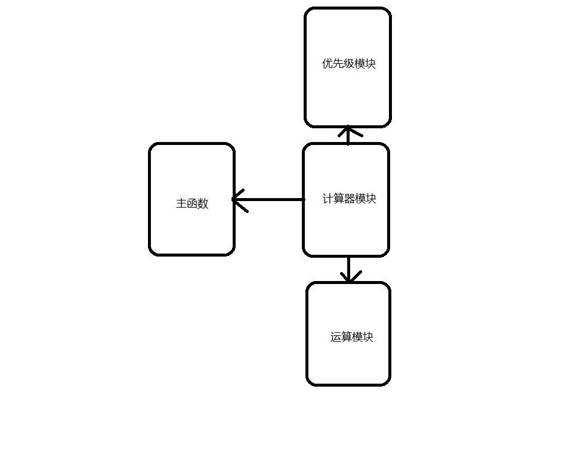
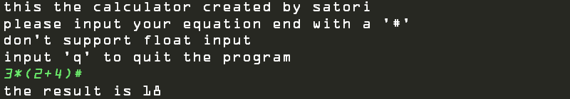
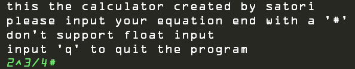
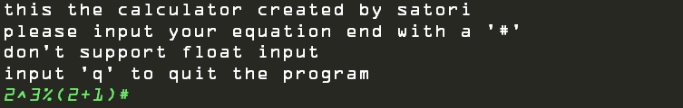

## 数据结构实验报告
### 题目：简易计算器（栈）

- 1. 需求分析	
- 2. 概要设计  	
    - 2.1抽象数据类型	
    - 2.2主程序的流程	
    - 2.3各程序模块之间的调用关系	
- 3. 详细分析
    - 3.1 实际数据结构
    - 3.2 主函数算法
    - 3.3 优先级算法
    - 3.4 运算模块算法
    - 3.5 计算器模块算法
- 4. 调试分析
- 5. 测试结果
- 6. 附录 程序源代码

### 1. 需求分析
通过模拟一个简单的计算器来进行+、-、*、/、%、^（乘方）等运算，从键盘上输入一算术表达式（一般为中缀表达式），计算出表达式的值。</br>
编写程序，要求可对一实数算术表达式进行简单的数学运算。
可以识别带加减乘除等运算符及括号的中缀表达式。
- a. 按照四则运算规则，求表达式的值。一般规则如下：
    1) 先括号内，再括号外。
    2) 先乘方，再乘除，后加减。
- b. 同级运算从左到右顺序执行。
- c. 如表达式有误，应给出相应的提示信息。


### 2. 概要分析
- #### 2.1 抽象数据类型
  
  本实验采用的抽象数据类型定义如下：
    ```
    ADT List{
        D={ai|ai属于Elemset,i=1,……n}
        数据关系：
        R={<ai-1.ai>|ai-1,ai属于D,i=2,……,n}
        基本操作：
        //创建空栈
        Status InitStack(SqStack *S);
        //获取栈顶元素
        Status GetTop(SqStack S,SElemType *e);
        //入栈
        Status Push(SqStack *S,SElemType e);
        //出栈
        Status Pop(SqStack *S,SElemType *e);
    }
    ```
- #### 2.2 主程序流程
  
  主函数的算法设计为，整体运行在一个while循环中，只有按下退出键q才会结束程序运行。其他情况下输入要计算的公式，以’#‘字符结尾进行输入<br>

- #### 2.3 各模块调用关系
    
    
  
    
### 3. 详细分析
- #### 3.1 实际数据结构
  
  实际程序中采用的数据结构如下：
  ```
  typedef struct SqStack
    {
        SElemType *base; /* 在栈构造之前和销毁之后，base的值为NULL */
        SElemType *top; /* 栈顶指针 */
        int stacksize; /* 当前已分配的存储空间，以元素为单位 */
    }SqStack; /* 顺序栈 */

  ```
  建立链表，链表包括栈底，栈顶，栈大小三个元素<br>
- #### 3.2 主函数算法
  主函数的伪代码如下：
  ```
    int main()
    {
        char user_input[MAX_LENGTH];
        while(TRUE)
        {
            //打印前台服务信息
            scanf("%s",user_input); //读入用户输入

            if(user_input[0] == 'q')
                return 0;           //若输入为q，退出程序
            else
                printf("the result is %d\n",calculator(user_input)-'0');    //调用计算器模块
            getchar();
        }
    }
  ```
- #### 3.3 优先级模块算法
   建立操作符表格和优先级表格，在涉及到比较操作数优先级时进行查表，返回'>','<'或是'='三种优先级比较结果<br>
   具体的实现算法如下:
   ```
    char OPSET[9] = {'+','-','*','/','(',')','#','^','%'};

    unsigned char Prior[9][9] = {
            /*'+'*/'>','>','<','<','<','>','>','<','<',
            /*'-'*/'>','>','<','<','<','>','>','<','<',
            /*'*'*/'>','>','>','>','<','>','>','<','>',
            /*'/'*/'>','>','>','>','<','>','>','<','>',
            /*'('*/'<','<','<','<','<','=',' ','<','<',
            /*')'*/'>','>','>','>',' ','>','>','>','>',
            /*'#'*/'<','<','<','<','<',' ','=','<','<',
            /*'^'*/'>','>','>','>','<','>','>','>','>',
            /*“%”*/'>','>','>','>','<','>','>','<','>'
    };
    
    int returnopord(char op)
    {
        for(int i=0;i<9;i++)
            if(op == OPSET[i]) return i;
    }

    char priority(char A,char B)
    {
        return Prior[returnopord(A)][returnopord(B)];
    }
   ```
- #### 3.4 运算模块算法

    将两个操作数和一个操作符读入，对其进行相应的运算
  
  ```
  char opertor(int a,int b,char ch)
    {
        int result = 0;
        switch (ch)
        {
            case '+':
            {
                result = (a-'0')+(b-'0');
                break;
            }
            case '-':
            {
                result = (a-'0')-(b-'0');
                break;
            }
            case '*':
            {
                result = (a-'0')*(b-'0');
                break;
            }
            case '/':
            {
                result = (a-'0')/(b-'0');
                break;
            }
            case '%':
            {
                result = (a-'0')%(b-'0');
                break;
            }
            case '^':
            {
                result = pow((a-'0'),(b-'0'));
            }
            default:
                break;
        }
        return result+'0';
    }
  ```
- #### 3.5 计算器模块算法
    
    每读入一个字符之后进行分类，如果是操作数则压入操作数栈，如果是操作符，则与操作符栈顶元素进行优先级比较，如果高于，则直接压入栈，如果等于则说明是一对括号，则将栈顶元素出栈，如果小于，则先将运算数栈顶的两个数进行运算符栈顶元素对应的运算，然后再压入操作数栈。
  
  ```
    char calculator(char *ch)
    {
        SqStack number,operator;
        char a,b,theta,result,optop='0';
        InitStack(&number);
        InitStack(&operator);
        Push(&operator,'#');
        while(*ch != '#' || optop != '#')
        {
            //如果是操作数则压入操作数栈
            if(*ch > '0' && *ch < '9')
            {
                Push(&number,*ch);
                ch++;
            }
            else
            {
                char top;
                GetTop(operator,&top);
                switch (priority(top,*ch))
                {
                    case '<':

                        Push(&operator,*ch);
                        ch++;
                        break;

                    case '=':

                        Pop(&operator,ch);
                        ch++;
                        break;

                    case '>':

                        Pop(&operator,&theta);
                        Pop(&number,&a);
                        Pop(&number,&b);
                        Push(&number,opertor(b,a,theta));
                        break;

                }
            }
            GetTop(operator,&optop);
        }
        GetTop(number,&result);
        return result;
    }
  ```

### 4. 调试分析

本次实验通过栈完成了一个简单的具有优先级的计算器，虽然功能比较简单，但是在完成的过程中我还是碰到了一些麻烦，最主要的就是一开始没有完全想好算法就开始写，导致一直写到写不下去了才推翻之前的所有代码重新构思。<br>
另外还是和上一次实验一样的问题，没有做非法输入检测，导致系统不稳定，很容易就卡死了。<br>
综上，总结出以下几点心得
1. 设计之前先想好需要哪些功能模块
2. 从功能模块出发去思考如何细分成更小的模块
3. 整理出可以编程实现的小模块，列出API表
4. 实现具体函数
5. 按照函数-->模块-->整体的顺序去进行功能测试

### 5. 测试结果

带括号的加法乘法运算<br>



乘方和除法运算



带括号的乘方和取余运算


### 6. 附录 程序源代码
stack.h
```
#ifndef TEST_STACK_H
#define TEST_STACK_H

#include <stdio.h>
#include <stdlib.h>
#include <malloc.h>
#include <windows.h>
#include <math.h>

#define SElemType char
#define MAX_LENGTH 100

typedef enum {
    OK,
}Status;

/* c3-1.h 栈的顺序存储表示 */
#define STACK_INIT_SIZE 10 /* 存储空间初始分配量 */
#define STACKINCREMENT 2 /* 存储空间分配增量 */
typedef struct SqStack
{
    SElemType *base; /* 在栈构造之前和销毁之后，base的值为NULL */
    SElemType *top; /* 栈顶指针 */
    int stacksize; /* 当前已分配的存储空间，以元素为单位 */
}SqStack; /* 顺序栈 */

Status InitStack(SqStack *S);

Status GetTop(SqStack S,SElemType *e);

Status Push(SqStack *S,SElemType e);

Status Pop(SqStack *S,SElemType *e);

char priority(char A,char B);

char opertor(int a,int b,char ch);

char calculator(char *ch);

#endif //TEST_STACK_H

```

stack.c
```
#include "stack.h"

char OPSET[9] = {'+','-','*','/','(',')','#','^','%'};

unsigned char Prior[9][9] = {
        /*'+'*/'>','>','<','<','<','>','>','<','<',
        /*'-'*/'>','>','<','<','<','>','>','<','<',
        /*'*'*/'>','>','>','>','<','>','>','<','>',
        /*'/'*/'>','>','>','>','<','>','>','<','>',
        /*'('*/'<','<','<','<','<','=',' ','<','<',
        /*')'*/'>','>','>','>',' ','>','>','>','>',
        /*'#'*/'<','<','<','<','<',' ','=','<','<',
        /*'^'*/'>','>','>','>','<','>','>','>','>',
        /*“%”*/'>','>','>','>','<','>','>','<','>'
};

/* bo3-1.c 顺序栈（存储结构由c3-1.h定义）的基本操作（9个） */
Status InitStack(SqStack *S)
{ /* 构造一个空栈S */
    (*S).base=(SElemType *)malloc(STACK_INIT_SIZE*sizeof(SElemType));
    if(!(*S).base)
        exit(OVERFLOW); /* 存储分配失败 */
    (*S).top=(*S).base;
    (*S).stacksize=STACK_INIT_SIZE;
    return OK;
}

Status GetTop(SqStack S,SElemType *e)
{ /* 若栈不空，则用e返回S的栈顶元素，并返回OK；否则返回ERROR */
    if(S.top>S.base)
    {
        *e=*(S.top-1);
        return OK;
    }
    else
        return ERROR;
}

Status Push(SqStack *S,SElemType e)
{ /* 插入元素e为新的栈顶元素 */
    if((*S).top-(*S).base>=(*S).stacksize) /* 栈满，追加存储空间 */
    {
        (*S).base=(SElemType *)realloc((*S).base,((*S).stacksize+STACKINCREMENT)*sizeof(SElemType));
        if(!(*S).base)
            exit(OVERFLOW); /* 存储分配失败 */
        (*S).top=(*S).base+(*S).stacksize;
        (*S).stacksize+=STACKINCREMENT;
    }
    *((*S).top)++=e;
    return OK;
}

Status Pop(SqStack *S,SElemType *e)
{ /* 若栈不空，则删除S的栈顶元素，用e返回其值，并返回OK；否则返回ERROR */
    if((*S).top==(*S).base)
        return ERROR;
    *e=*--(*S).top;
    return OK;
}

int returnopord(char op)
{
    for(int i=0;i<9;i++)
        if(op == OPSET[i]) return i;
}

char priority(char A,char B)
{
    return Prior[returnopord(A)][returnopord(B)];
}

char opertor(int a,int b,char ch)
{
    int result = 0;
    switch (ch)
    {
        case '+':
        {
            result = (a-'0')+(b-'0');
            break;
        }
        case '-':
        {
            result = (a-'0')-(b-'0');
            break;
        }
        case '*':
        {
            result = (a-'0')*(b-'0');
            break;
        }
        case '/':
        {
            result = (a-'0')/(b-'0');
            break;
        }
        case '%':
        {
            result = (a-'0')%(b-'0');
            break;
        }
        case '^':
        {
            result = pow((a-'0'),(b-'0'));
        }
        default:
            break;
    }
    return result+'0';
}

char calculator(char *ch)
{
    SqStack number,operator;
    char a,b,theta,result,optop='0';
    InitStack(&number);
    InitStack(&operator);
    Push(&operator,'#');
    while(*ch != '#' || optop != '#')
    {
        //如果是操作数则压入操作数栈
        if(*ch > '0' && *ch < '9')
        {
            Push(&number,*ch);
            ch++;
        }
        else
        {
            char top;
            GetTop(operator,&top);
            switch (priority(top,*ch))
            {
                case '<':

                    Push(&operator,*ch);
                    ch++;
                    break;

                case '=':

                    Pop(&operator,ch);
                    ch++;
                    break;

                case '>':

                    Pop(&operator,&theta);
                    Pop(&number,&a);
                    Pop(&number,&b);
                    Push(&number,opertor(b,a,theta));
                    break;

            }
        }
        GetTop(operator,&optop);
    }
    GetTop(number,&result);
    return result;
}

```
main.c
```
#include "stack.h"

int main()
{
    char user_input[MAX_LENGTH];
    while(TRUE)
    {
        printf("this the calculator created by satori\n");
        printf("please input your equation end with a '#'\n");
        printf("don't support float input\n");
        printf("input 'q' to quit the program\n");
        scanf("%s",user_input);

        if(user_input[0] == 'q')
            return 0;
        else
            printf("the result is %d\n",calculator(user_input)-'0');
        getchar();
    }
}

```